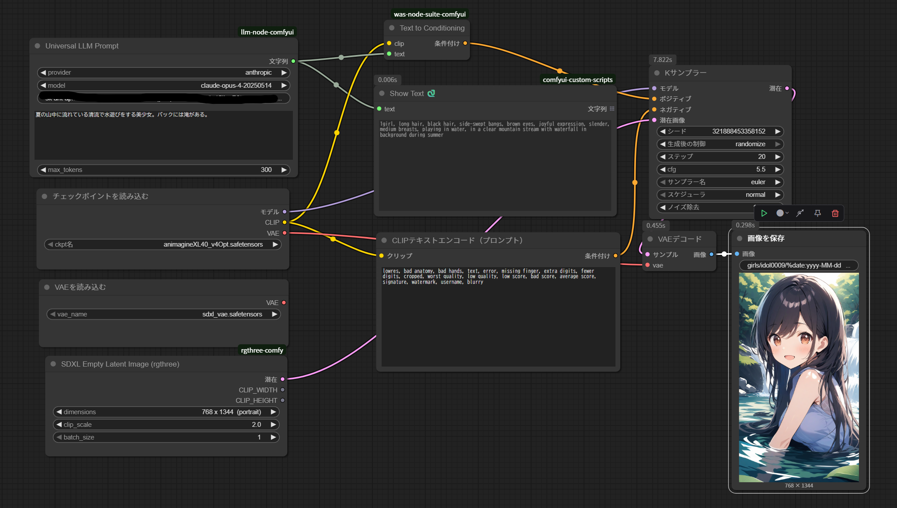

# Universal LLM Node for ComfyUI

## これはなに？

UniversalLLMNodeは、OpenAI・Anthropic（Claude）・Google Gemini・Groq・Mistralなど複数の大手LLM APIを共通インターフェースで利用できるComfyUI用カスタムノードです。  
画像生成向けの高品質なSDXLプロンプトを自動生成する用途などに最適です。

## 使い方（日本語）

1. **provider** で利用したいLLMサービス（openai, anthropic, google, groq, mistral）を選択します。
2. **model** で利用したいモデル名を選択します（リストから選択）。
3. **prompt** にシーンやタグなど、画像生成に使いたい内容を入力します。
4. **max_tokens** で返答の最大トークン数を指定します（通常は300程度で十分です）。
5. ノードを実行すると、各社LLM APIを使ってSDXL用の高品質なプロンプトが自動生成されます。

> ※ providerごとに利用できるモデル名は異なります。APIキーの設定も忘れずに行ってください。

## What is this?

UniversalLLMNode is a custom node for ComfyUI that lets you use multiple major LLM APIs (OpenAI, Anthropic/Claude, Google Gemini, Groq, Mistral) with a unified interface.  
It is ideal for automatically generating high-quality SDXL prompts for image generation and similar tasks.

## Usage (English)

1. Select the **provider** (openai, anthropic, google, groq, mistral) you want to use.
2. Choose the **model** from the list of available models for the selected provider.
3. Enter your scene description or tags in the **prompt** field.
4. Set **max_tokens** to limit the maximum number of tokens in the response (300 is usually enough).
5. Run the node. It will use the selected LLM API to automatically generate a high-quality SDXL prompt.

> *Note: Available models depend on the provider. Make sure to set your API keys for each service.*